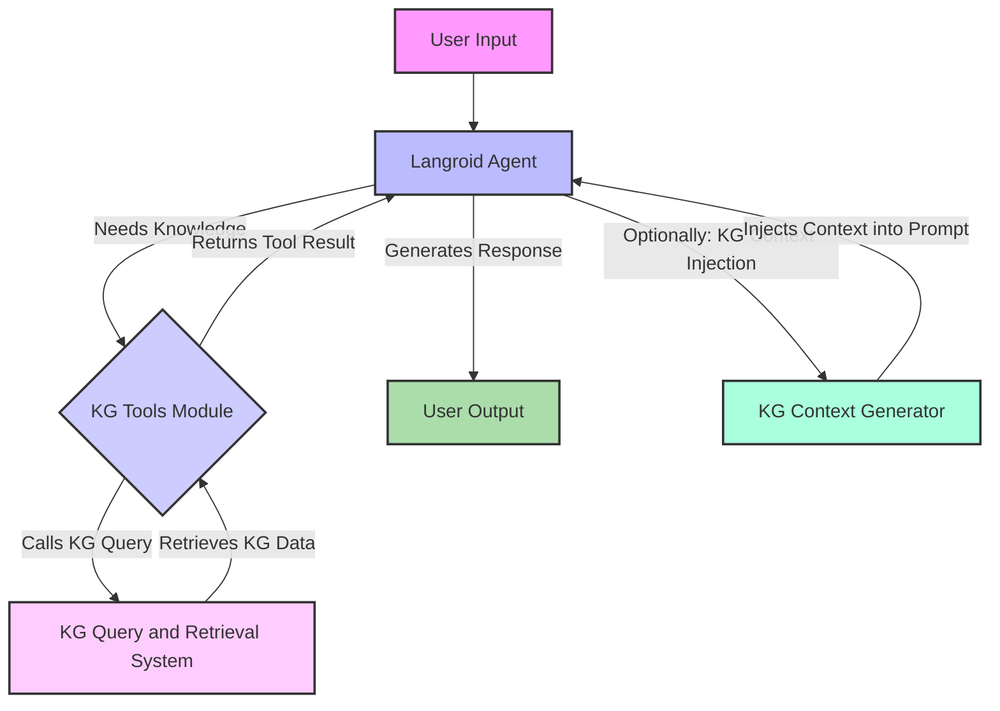

# Langroid Agent Integration with Knowledge Graph Design

## Overview

This document outlines the design for integrating Langroid agents with the Clinical Corvus Knowledge Graph (KG). The goal is to empower Langroid agents with access to high-quality, curated medical knowledge for enhanced reasoning, decision-making, and interaction within the application.

## Design Principles

### Core Principles

1.  **Seamless Integration**: Provide Langroid agents with transparent and efficient access to KG data.
2.  **Contextual Awareness**: Enable agents to leverage KG for rich, context-aware understanding.
3.  **Actionable Knowledge**: Translate KG insights into actionable steps for agents.
4.  **Scalability**: Ensure the integration can support a growing number of agents and KG data.
5.  **Modularity**: Design the integration in a modular way to allow for flexible agent architectures and KG evolutions.
6.  **Observability**: Provide mechanisms to monitor agent-KG interactions and knowledge utilization.
7.  **Clinical Safety**: All medical advice must include provenance and evidence scores with explicit safety guards.
8.  **Authentication & Authorization**: Enforce mTLS/JWT with per-tool RBAC for secure KG access.
9.  **Performance Optimization**: Implement token budget management, caching, and query optimization.
10. **Compliance & Auditability**: Log all agent-KG interactions for regulatory compliance.

### Modeling Approach

1.  **Tool-Based Interaction**: Expose KG functionalities as tools that Langroid agents can use.
2.  **GraphRAG Integration**: Integrate Langroid agents with the Hybrid GraphRAG system for comprehensive knowledge retrieval.
3.  **Semantic Reasoning**: Enable agents to perform complex semantic reasoning over KG data.
4.  **Knowledge Injection**: Inject relevant KG context into agent prompts for improved performance.

## Agent-KG Interaction Architecture

### Components

1.  **Langroid Agent**: The AI agent that requires access to medical knowledge.
2.  **KG Query and Retrieval System**: The system responsible for querying and retrieving information from the KG and search indices (as designed in `kg_query_retrieval_system.md`).
3.  **KG Tools Module**: A set of Langroid-compatible tools that encapsulate KG functionalities.
4.  **KG Context Generator**: A component that constructs relevant KG context for agent prompts.
5.  **Agent Memory/Knowledge Base**: Where the agent stores its working memory and possibly integrates KG-derived facts.

### Data Flow



## KG Tools Module

### Purpose

Provide a standardized interface for Langroid agents to interact with the Knowledge Graph, abstracting away the complexities of Cypher queries and data parsing.

### Tool Definitions (Examples)

Each tool will correspond to a function in the KG Query and Retrieval System.

#### 1. `search_medical_entity`
-   **Description**: Searches the Knowledge Graph for medical entities (diseases, drugs, symptoms, etc.) matching a given query.
-   **Inputs**: `query` (str), `entity_types` (List[str], optional), `limit` (int, optional).
-   **Outputs**: List of matching entities with properties.
-   **Underlying KG Call**: `KGQueryAndRetrievalSystem.execute_query(query_type="entity_search", parameters={"query": query, "entity_types": entity_types, "limit": limit})`

#### 2. `find_medical_relationships`
-   **Description**: Finds relationships between two specified medical entities in the KG, or all relationships involving a single entity.
-   **Inputs**: `source_entity_name` (str), `target_entity_name` (str, optional), `relationship_types` (List[str], optional).
-   **Outputs**: List of relationships with their properties and connected entities.
-   **Underlying KG Call**: `KGQueryAndRetrievalSystem.execute_query(query_type="relationship_query", parameters={"source_entity": source_entity_name, "target_entity": target_entity_name, "relationship_types": relationship_types})`

#### 3. `traverse_medical_graph`
-   **Description**: Explores the connections around a specific medical entity in the KG up to a certain depth.
-   **Inputs**: `start_entity_name` (str), `max_depth` (int, optional), `relationship_filters` (Dict, optional).
-   **Outputs**: A subgraph of connected entities and relationships.
-   **Underlying KG Call**: `KGQueryAndRetrievalSystem.execute_query(query_type="graph_traversal", parameters={"start_entity": start_entity_name, "max_depth": max_depth, "relationship_filters": relationship_filters})`

#### 4. `check_contradiction_status`
-   **Description**: Checks the contradiction status and evidence score of a specific piece of knowledge (entity or relationship) in the KG.
-   **Inputs**: `knowledge_id` (str), `knowledge_type` (str, "entity" or "relationship").
-   **Outputs**: Details on contradiction flags, resolution status, and evidence score.
-   **Underlying KG Call**: Direct query to the KG to retrieve contradiction and evidence properties.

### Standardized Tool Response Schema

All KG tools must return a standardized response format for consistent parsing and error handling:

```python
from pydantic import BaseModel
from typing import Any, Dict, List, Optional
import asyncio
import time
import json

class ToolMetadata(BaseModel):
    elapsed_ms: int
    cache_hit: bool = False
    db_node_count: Optional[int] = None

class ProvenanceItem(BaseModel):
    source: str
    source_id: Optional[str] = None
    evidence_snippet: Optional[str] = None
    evidence_score: Optional[float] = None

class ToolResponse(BaseModel):
    success: bool
    results: List[Dict[str, Any]]
    metadata: Optional[ToolMetadata]
    provenance: Optional[List[ProvenanceItem]] = None
    error: Optional[str] = None

async def call_with_timeout(coro, timeout=3.0):
    """Wrapper for KG calls with timeout and retry logic."""
    return await asyncio.wait_for(coro, timeout=timeout)
```

### Enhanced Langroid Tool Definition

```python
from langroid.agent.tool_agent import Tool
from pydantic import BaseModel, Field
from typing import List, Dict, Any, Optional, Type
import logging

logger = logging.getLogger(__name__)

class SearchMedicalEntityArgs(BaseModel):
    query: str = Field(..., description="The search query for medical entities.")
    entity_types: Optional[List[str]] = Field(None, description="Optional list of specific entity types (e.g., 'Disease', 'Drug').")
    limit: int = Field(10, description="Maximum number of results to return.")

class SearchMedicalEntityTool(Tool):
    name: str = "search_medical_entity"
    description: str = "Searches the Knowledge Graph for medical entities (diseases, drugs, symptoms, etc.) matching a given query."
    args_schema: Type[BaseModel] = SearchMedicalEntityArgs

    async def _call(self, args: SearchMedicalEntityArgs) -> str:
        start_time = time.time()
        try:
            # Call KG query system with timeout
            raw = await call_with_timeout(
                kg_query_system.execute_query(
                    query_type="entity_search",
                    parameters={
                        "query": args.query,
                        "entity_types": args.entity_types,
                        "limit": args.limit
                    }
                ),
                timeout=3.0
            )
            
            # Convert to standardized ToolResponse
            elapsed_ms = int((time.time() - start_time) * 1000)
            tr = ToolResponse(
                success=raw.get("success", True),
                results=raw.get("data", [])[:args.limit],
                metadata=ToolMetadata(
                    elapsed_ms=elapsed_ms,
                    cache_hit=raw.get("metadata", {}).get("cache_hit", False),
                    db_node_count=raw.get("metadata", {}).get("node_count")
                ),
                provenance=raw.get("metadata", {}).get("provenance", [])
            )
            
            # Log for audit purposes
            logger.info(f"KG tool call: {self.name}", extra={
                "agent_id": getattr(self, 'agent_id', None),
                "user_id": getattr(self, 'user_id', None),
                "query": args.query,
                "results_count": len(tr.results),
                "elapsed_ms": elapsed_ms
            })
            
            return tr.json()
            
        except asyncio.TimeoutError:
            error_response = ToolResponse(
                success=False,
                results=[],
                error="Query timeout exceeded"
            )
            return error_response.json()
        except Exception as e:
            logger.error(f"KG tool error: {str(e)}")
            error_response = ToolResponse(
                success=False,
                results=[],
                error=str(e)
            )
            return error_response.json()
```

## Enhanced KG Context Generator

### Purpose

Dynamically retrieve and format relevant KG information with prioritization, compression, and provenance tracking to optimize token usage and ensure clinical safety.

### Key Features

1.  **Query Expansion**: Expand user queries with synonyms or related concepts from the KG.
2.  **Entity Linking**: Identify entities in the user's query or conversation history and link them to KG nodes.
3.  **Contextual Snippet Retrieval**: Retrieve short, relevant facts or relationships from the KG related to identified entities.
4.  **Fact Ranking & Compression**: Prioritize facts by evidence score and compress using summarization.
5.  **Provenance Tracking**: Attach source information and evidence scores to all facts.
6.  **Token Budget Management**: Respect LLM token limits through intelligent truncation.

### Implementation

```python
import asyncio
from typing import Dict, Any, List, Optional
import logging

logger = logging.getLogger(__name__)

class KGContextGenerator:
    def __init__(self, kg_query_system, clinical_roberta_service):
        self.kg_query_system = kg_query_system
        self.clinical_roberta_service = clinical_roberta_service

    async def generate_context(
        self,
        user_query: str,
        conversation_history: List[Dict[str, str]],
        max_tokens: int = 500
    ) -> str:
        """
        Generate relevant KG context with prioritization and compression.
        """
        context_parts = []
        current_token_count = 0

        # 1. Entity Linking from current query
        entities_in_query = await self.clinical_roberta_service.extract_entities(user_query)
        kg_linked_entities = []
        
        for entity in entities_in_query:
            try:
                kg_search_results = await call_with_timeout(
                    self.kg_query_system.execute_query(
                        query_type="entity_search",
                        parameters={"query": entity.get("text"), "limit": 1}
                    ),
                    timeout=2.0
                )
                if kg_search_results and kg_search_results.get("results"):
                    kg_linked_entities.append(kg_search_results["results"][0])
            except asyncio.TimeoutError:
                logger.warning(f"Timeout during entity linking for: {entity.get('text')}")
                continue
        
        # 2. Gather and rank facts
        all_facts = []
        for entity in kg_linked_entities:
            entity_name = entity.get("properties", {}).get("name", "Unknown Entity")
            entity_id = entity.get("id")
            
            try:
                relationships = await call_with_timeout(
                    self.kg_query_system.execute_query(
                        query_type="relationship_query",
                        parameters={"source_entity": entity_id, "limit": 5}
                    ),
                    timeout=2.0
                )
                
                if relationships and relationships.get("results"):
                    for rel in relationships["results"]:
                        fact = self._create_fact_with_provenance(rel, entity_name)
                        if fact:
                            all_facts.append(fact)
            except asyncio.TimeoutError:
                logger.warning(f"Timeout during relationship query for: {entity_name}")
                continue
        
        # 3. Rank facts by evidence score and recency
        ranked_facts = self._rank_facts(all_facts)
        
        # 4. Build context respecting token budget
        for fact in ranked_facts:
            formatted_fact = self._format_fact(fact)
            fact_tokens = len(formatted_fact.split())
            
            if current_token_count + fact_tokens <= max_tokens:
                context_parts.append(formatted_fact)
                current_token_count += fact_tokens
            else:
                break
        
        # 5. Apply extractive summarization if needed
        if current_token_count > max_tokens * 0.8:  # If using >80% of budget
            context_parts = self._compress_facts(context_parts, max_tokens)

        if context_parts:
            return "Knowledge Graph Context:\n" + "\n".join(context_parts)
        return ""

    def _rank_facts(self, facts: List[Dict[str, Any]]) -> List[Dict[str, Any]]:
        """Rank facts by evidence score, provenance weight, and recency."""
        return sorted(
            facts,
            key=lambda f: (
                f.get("evidence_score", 0.0),
                f.get("recency_ts", 0),
                f.get("provenance_weight", 0.5)
            ),
            reverse=True
        )

    def _create_fact_with_provenance(self, relationship: Dict[str, Any], source_name: str) -> Optional[Dict[str, Any]]:
        """Create a fact object with provenance information."""
        target_name = relationship.get("target", {}).get("properties", {}).get("name", "unknown entity")
        rel_type = relationship.get("relationship", {}).get("type", "is related to").replace("_", " ").lower()
        
        # Extract provenance from relationship metadata
        metadata = relationship.get("metadata", {})
        evidence_score = metadata.get("evidence_score", 0.0)
        source_info = metadata.get("source", "Unknown")
        
        return {
            "subject": source_name,
            "predicate": rel_type,
            "object": target_name,
            "evidence_score": evidence_score,
            "source": source_info,
            "recency_ts": metadata.get("created_at", 0),
            "provenance_weight": self._calculate_provenance_weight(source_info)
        }

    def _calculate_provenance_weight(self, source: str) -> float:
        """Calculate weight based on source reliability."""
        weights = {
            "pubmed": 1.0,
            "cochrane": 1.0,
            "uptodate": 0.9,
            "guidelines": 0.8,
            "textbook": 0.7,
            "wikipedia": 0.3
        }
        return weights.get(source.lower(), 0.5)

    def _format_fact(self, fact: Dict[str, Any]) -> str:
        """Format fact with provenance information."""
        return (f"- {fact['subject']} {fact['predicate']} {fact['object']} "
                f"(source={fact['source']}, score={fact['evidence_score']:.2f})")

    def _compress_facts(self, facts: List[str], max_tokens: int) -> List[str]:
        """Apply extractive summarization to compress facts."""
        # Simple compression: prioritize highest-scored facts
        compressed = []
        token_count = 0
        
        for fact in facts:
            fact_tokens = len(fact.split())
            if token_count + fact_tokens <= max_tokens:
                compressed.append(fact)
                token_count += fact_tokens
            else:
                break
        
        return compressed
```

## Langroid Agent Configuration

### Agent Definition

Langroid agents will be configured to use the `KG Tools Module` and optionally `KG Context Generator`.

```python
from langroid.agent.tool_agent import ToolAgent, ToolAgentConfig
from langroid.agent.chat_agent import ChatAgent, ChatAgentConfig
from langroid.language_models.openai_gpt import OpenAIChatModel, OpenAIChatConfig
from langroid.utils.system import get_env_variable

# Initialize your KG services (mocked for this example)
# mock_kg_query_system = MockKGQuerySystem()
# mock_clinical_roberta = MockClinicalRoBERTaService()
# kg_context_generator = KGContextGenerator(mock_kg_query_system, mock_clinical_roberta)

class MedicalResearchAgentConfig(ToolAgentConfig):
    llm: OpenAIChatConfig = OpenAIChatConfig(
        chat_model=OpenAIChatModel.GPT4_TURBO,
        temperature=0.7,
        stream=True
    )
    vecdb: None = None # No internal vecdb for this agent, relies on KG
    system_message: str = """
    You are an expert medical research assistant. Use the available tools to answer medical questions.
    Always strive to provide evidence-based answers.
    {kg_context} # Placeholder for KG context injected by KGContextGenerator
    """

class MedicalResearchAgent(ToolAgent):
    def __init__(self, config: MedicalResearchAgentConfig, kg_context_generator: KGContextGenerator):
        super().__init__(config)
        self.kg_context_generator = kg_context_generator
        # Register KG tools
        self.enable_tools([
            SearchMedicalEntityTool,
            FindMedicalRelationshipsTool, # Assuming this is defined
            TraverseMedicalGraphTool # Assuming this is defined
        ])

    async def _get_llm_response(self, message: str) -> str:
        # Generate KG context before sending to LLM
        kg_context = await self.kg_context_generator.generate_context(
            user_query=message, 
            conversation_history=self.message_history # Assuming message_history is accessible
        )
        # Inject context into the system message
        self.config.system_message = self.config.system_message.format(kg_context=kg_context)
        
        # Call the parent method to get LLM response
        return await super()._get_llm_response(message)

# Example of how an agent might be initialized and used
# async def main():
#     agent_config = MedicalResearchAgentConfig()
#     kg_context_gen = KGContextGenerator(mock_kg_query_system, mock_clinical_roberta)
#     agent = MedicalResearchAgent(agent_config, kg_context_gen)
#     
#     response = await agent.llm_response("What are the treatments for Type 2 Diabetes?")
#     print(response.content)
```

## Security & Compliance Framework

### Authentication & Authorization

All agent-KG interactions must be authenticated and authorized:

```python
from typing import Optional
import jwt
from functools import wraps

class AgentAuthenticator:
    def __init__(self, secret_key: str):
        self.secret_key = secret_key

    def authenticate_agent(self, token: str) -> Optional[Dict[str, Any]]:
        """Authenticate agent using JWT token."""
        try:
            payload = jwt.decode(token, self.secret_key, algorithms=["HS256"])
            return {
                "agent_id": payload.get("agent_id"),
                "user_id": payload.get("user_id"),
                "roles": payload.get("roles", []),
                "scopes": payload.get("scopes", [])
            }
        except jwt.InvalidTokenError:
            return None

    def check_tool_permission(self, user_context: Dict[str, Any], tool_name: str) -> bool:
        """Check if user has permission for specific tool."""
        tool_permissions = {
            "search_medical_entity": ["patient", "doctor", "researcher"],
            "check_contradiction_status": ["researcher", "doctor"],
            "traverse_medical_graph": ["doctor"],
            "find_medical_relationships": ["doctor", "researcher"]
        }
        
        user_roles = user_context.get("roles", [])
        required_roles = tool_permissions.get(tool_name, [])
        
        return any(role in user_roles for role in required_roles)

def require_auth(tool_name: str):
    """Decorator to enforce authentication for KG tools."""
    def decorator(func):
        @wraps(func)
        async def wrapper(self, args, **kwargs):
            # Extract auth context (implementation depends on Langroid integration)
            auth_context = getattr(self, 'auth_context', None)
            if not auth_context:
                raise PermissionError("Authentication required")
            
            authenticator = AgentAuthenticator(os.getenv("JWT_SECRET"))
            if not authenticator.check_tool_permission(auth_context, tool_name):
                raise PermissionError(f"Insufficient permissions for {tool_name}")
                
            return await func(self, args, **kwargs)
        return wrapper
    return decorator
```

### Contradiction Handling Schema

Define explicit schema for handling contradictory medical information:

```python
from pydantic import BaseModel
from typing import List, Optional
from enum import Enum

class ContradictionStatus(str, Enum):
    FLAGGED = "flagged"
    UNDER_REVIEW = "under_review"
    RESOLVED = "resolved"
    DEPRECATED = "deprecated"

class EvidenceItem(BaseModel):
    source: str
    id: Optional[str] = None
    snippet: Optional[str] = None
    score: float

class ContradictingFact(BaseModel):
    kg_fact_id: str
    evidence: List[EvidenceItem]
    confidence: float

class KGNodeRef(BaseModel):
    id: str
    name: str

class ContradictionRecord(BaseModel):
    id: str
    subject: KGNodeRef
    predicate: str
    object: KGNodeRef
    evidence: List[EvidenceItem]
    confidence: float
    contradiction_with: List[ContradictingFact]
    status: ContradictionStatus
    created_at: str
    resolved_at: Optional[str] = None
    resolution_notes: Optional[str] = None

class CheckContradictionTool(Tool):
    name: str = "check_contradiction_status"
    description: str = "Check contradiction status and evidence for medical facts."
    
    @require_auth("check_contradiction_status")
    async def _call(self, args) -> str:
        # Implementation that returns ContradictionRecord
        contradiction_data = await self._get_contradiction_data(args.knowledge_id)
        if contradiction_data:
            record = ContradictionRecord(**contradiction_data)
            return record.json()
        return json.dumps({"message": "No contradictions found"})
```

### Hallucination Mitigation

Implement post-processing to ensure medical claims have KG support:

```python
import re
from typing import List, Tuple

class MedicalClaimValidator:
    def __init__(self, kg_query_system):
        self.kg_query_system = kg_query_system
        self.medical_verbs = ["treats", "causes", "prevents", "indicates", "contraindicated"]

    async def validate_response(self, response: str, min_evidence_score: float = 0.8) -> str:
        """Validate LLM response for unsupported medical claims."""
        claims = self._extract_medical_claims(response)
        validated_response = response
        
        for claim in claims:
            has_support = await self._check_claim_support(claim, min_evidence_score)
            if not has_support:
                # Replace claim with hedged version
                hedge = "I couldn't find high-confidence evidence in the KG; consider human review."
                validated_response = validated_response.replace(claim, f"{claim} ({hedge})")
        
        return validated_response

    def _extract_medical_claims(self, text: str) -> List[str]:
        """Extract potential medical claims using heuristics."""
        sentences = re.split(r'[.!?]+', text)
        claims = []
        
        for sentence in sentences:
            # Simple heuristic: sentences with medical verbs
            if any(verb in sentence.lower() for verb in self.medical_verbs):
                claims.append(sentence.strip())
        
        return claims

    async def _check_claim_support(self, claim: str, min_score: float) -> bool:
        """Check if claim has KG support with sufficient evidence score."""
        try:
            # Extract entities from claim
            entities = await self._extract_entities_from_claim(claim)
            if len(entities) < 2:
                return False
            
            # Search for relationships between entities
            relationship_query = await self.kg_query_system.execute_query(
                query_type="relationship_query",
                parameters={
                    "source_entity": entities[0],
                    "target_entity": entities[1],
                    "min_evidence_score": min_score
                }
            )
            
            return bool(relationship_query.get("results"))
        except Exception:
            return False
```

### Observability & Monitoring

Comprehensive logging and metrics for agent-KG interactions:

```python
import time
from prometheus_client import Counter, Histogram, Gauge

# Prometheus metrics
kg_tool_calls = Counter('agent_kg_tool_calls_total', 'Total KG tool calls', ['tool', 'agent'])
kg_tool_latency = Histogram('agent_kg_tool_latency_ms', 'KG tool latency', ['tool'])
kg_tool_errors = Counter('agent_kg_tool_errors_total', 'KG tool errors', ['tool'])
active_kg_connections = Gauge('agent_kg_active_connections', 'Active KG connections')

class ObservabilityMixin:
    """Mixin to add observability to KG tools."""
    
    def log_tool_call(self, tool_name: str, agent_id: str, user_id: str,
                     query: str, results_count: int, elapsed_ms: int):
        """Log tool call for audit purposes."""
        logger.info(f"KG tool call: {tool_name}", extra={
            "agent_id": agent_id,
            "user_id": user_id,
            "tool_name": tool_name,
            "query_hash": hashlib.sha256(query.encode()).hexdigest()[:16],
            "results_count": results_count,
            "elapsed_ms": elapsed_ms,
            "timestamp": time.time()
        })
        
        # Update metrics
        kg_tool_calls.labels(tool=tool_name, agent=agent_id).inc()
        kg_tool_latency.labels(tool=tool_name).observe(elapsed_ms)

    def log_tool_error(self, tool_name: str, error: str):
        """Log tool errors."""
        logger.error(f"KG tool error: {tool_name}", extra={
            "tool_name": tool_name,
            "error": error,
            "timestamp": time.time()
        })
        kg_tool_errors.labels(tool=tool_name).inc()
```

## Integration Points

### FastAPI Backend with Security

```python
from fastapi import FastAPI, Depends, HTTPException, Header
from fastapi.security import HTTPBearer

app = FastAPI()
security = HTTPBearer()

async def verify_agent_token(authorization: str = Header(...)):
    """Verify agent JWT token."""
    try:
        token = authorization.split(" ")[1]  # Bearer <token>
        authenticator = AgentAuthenticator(os.getenv("JWT_SECRET"))
        auth_context = authenticator.authenticate_agent(token)
        if not auth_context:
            raise HTTPException(status_code=401, detail="Invalid token")
        return auth_context
    except Exception:
        raise HTTPException(status_code=401, detail="Authentication failed")

@app.post("/api/agents/kg-query")
async def agent_kg_query(
    request: Dict[str, Any],
    auth_context: Dict = Depends(verify_agent_token)
):
    """Secure endpoint for agent KG queries."""
    tool_name = request.get("tool_name")
    
    # Check permissions
    authenticator = AgentAuthenticator(os.getenv("JWT_SECRET"))
    if not authenticator.check_tool_permission(auth_context, tool_name):
        raise HTTPException(status_code=403, detail="Insufficient permissions")
    
    # Execute tool with auth context
    # Implementation depends on specific tool
    pass
```

### MCP Server Integration

-   KG functionalities exposed as MCP tools with same security model
-   Consistent response schemas across MCP and direct integration
-   Rate limiting and circuit breaker patterns applied

### User Interface

-   Agent responses include provenance information for transparency
-   Evidence scores displayed to help users assess reliability
-   Clear indicators when information lacks high-confidence support

## Implementation Roadmap

### Phase 1: Security & Foundation
- [ ] Implement standardized `ToolResponse` schema for all KG tools
- [ ] Add authentication/authorization framework with JWT and RBAC
- [ ] Implement timeout/retry mechanisms with circuit breaker pattern
- [ ] Create audit logging system for all agent-KG interactions
- [ ] Develop `ContradictionRecord` schema and validation system

### Phase 2: Core Tool Integration with Safety
- [ ] Implement enhanced `KG Tools Module` with provenance tracking
- [ ] Add medical claim validation and hallucination mitigation
- [ ] Develop token-budget-aware `KG Context Generator`
- [ ] Create observability dashboard with Prometheus metrics
- [ ] Integrate with existing `KG Query and Retrieval System`

### Phase 3: Advanced Features & Performance
- [ ] Implement fact ranking and compression algorithms
- [ ] Add extractive summarization for context optimization
- [ ] Develop multi-hop reasoning with evidence aggregation
- [ ] Create agent specialization patterns for different clinical tasks
- [ ] Implement feedback loops for continuous improvement

### Phase 4: Production Readiness
- [ ] Complete load testing and performance optimization
- [ ] Implement comprehensive error handling and graceful degradation
- [ ] Add regulatory compliance features (audit trails, data retention)
- [ ] Create monitoring and alerting for production deployment
- [ ] Develop disaster recovery and backup procedures

## Comprehensive Testing Strategy

### Unit Testing
- **Tool Schema Compliance**: Validate all tools return standardized `ToolResponse` format
- **Authentication**: Test JWT validation and RBAC enforcement for each tool
- **Timeout Handling**: Verify timeout and retry mechanisms under various failure scenarios
- **Context Generation**: Test fact ranking, compression, and token budget management
- **Contradiction Detection**: Validate contradiction schema and resolution workflows

### Integration Testing
- **End-to-End Security**: Test complete auth flow from agent request to KG response
- **Provenance Propagation**: Verify evidence scores and source information flow correctly
- **Token Budget Compliance**: Ensure context generation respects LLM token limits
- **Error Cascading**: Test graceful degradation when KG services are unavailable
- **Multi-Agent Scenarios**: Test concurrent agent access with proper isolation

### Safety Testing
- **Hallucination Detection**: Verify agents never produce high-risk medical claims without evidence score ≥ 0.8
- **Provenance Validation**: Ensure all medical assertions include proper source attribution
- **Claim Support Verification**: Test medical claim validator against known unsupported statements
- **Contradiction Handling**: Verify proper flagging and resolution of contradictory medical information

### Performance Testing
- **Concurrent Load**: Test 50+ concurrent agents with KG access, measure throughput and tail latency
- **Memory Pressure**: Monitor memory usage under large knowledge graph traversals
- **Cache Effectiveness**: Measure cache hit rates and performance improvement
- **Timeout Resilience**: Verify system stability under various timeout scenarios

### Compliance Testing
- **Audit Logging**: Verify every agent-KG interaction generates proper audit logs
- **Data Retention**: Test automated cleanup of logs according to retention policies
- **Access Control**: Validate RBAC prevents unauthorized access to sensitive medical data
- **Error Reporting**: Ensure security incidents are properly logged and alerting works

### Example Test Cases

```python
import pytest
from unittest.mock import AsyncMock, MagicMock

class TestKGToolSafety:
    @pytest.mark.asyncio
    async def test_medical_claim_requires_high_evidence(self):
        """Test that high-risk medical claims require evidence score ≥ 0.8"""
        validator = MedicalClaimValidator(mock_kg_system)
        
        # Test claim without sufficient evidence
        low_evidence_response = "Aspirin treats cancer."
        validated = await validator.validate_response(low_evidence_response, min_evidence_score=0.8)
        
        assert "I couldn't find high-confidence evidence" in validated

    @pytest.mark.asyncio
    async def test_tool_response_schema(self):
        """Test all tools return standardized ToolResponse"""
        tool = SearchMedicalEntityTool()
        args = SearchMedicalEntityArgs(query="diabetes")
        
        response_str = await tool._call(args)
        response = json.loads(response_str)
        
        # Validate schema
        assert "success" in response
        assert "results" in response
        assert "metadata" in response
        assert "provenance" in response

    @pytest.mark.asyncio
    async def test_concurrent_agent_load(self):
        """Test system under 50 concurrent agent requests"""
        async def agent_request():
            tool = SearchMedicalEntityTool()
            return await tool._call(SearchMedicalEntityArgs(query="hypertension"))
        
        # Run 50 concurrent requests
        start_time = time.time()
        tasks = [agent_request() for _ in range(50)]
        results = await asyncio.gather(*tasks, return_exceptions=True)
        elapsed = time.time() - start_time
        
        # Validate performance and error rates
        errors = [r for r in results if isinstance(r, Exception)]
        assert len(errors) < 5  # <10% error rate
        assert elapsed < 10.0   # Complete within 10 seconds

    def test_audit_log_generation(self):
        """Test that audit logs are generated for all KG calls"""
        with patch('logging.Logger.info') as mock_log:
            tool = SearchMedicalEntityTool()
            # Simulate tool call with auth context
            tool.log_tool_call(
                "search_medical_entity",
                "agent-123",
                "user-456",
                "diabetes treatment",
                5,
                150
            )
            
            mock_log.assert_called_once()
            log_extra = mock_log.call_args[1]['extra']
            assert log_extra['agent_id'] == 'agent-123'
            assert log_extra['user_id'] == 'user-456'
            assert 'query_hash' in log_extra
```

## Future Enhancements

### Advanced AI Capabilities
-   **Proactive Knowledge Retrieval**: Agents anticipate knowledge needs based on conversation patterns
-   **Multi-Modal Integration**: Support for image analysis and integration with KG medical imaging data
-   **Temporal Reasoning**: Track changes in medical knowledge over time with version control
-   **Causal Inference**: Advanced reasoning about cause-effect relationships in medical contexts

### Enterprise Features
-   **KG Update Agents**: Agents capable of proposing evidence-based updates to the KG with peer review
-   **Personalized KG Interaction**: Adaptive querying based on user expertise level and preferences
-   **Multi-Language KG**: Support for medical knowledge in multiple languages with cross-translation
-   **Federated KG**: Integration with external medical knowledge bases and EMR systems

### Explainability & Trust
-   **Reasoning Provenance**: Complete audit trail showing how conclusions were reached
-   **Confidence Calibration**: Better alignment between stated confidence and actual accuracy
-   **Counterfactual Analysis**: "What if" scenarios showing alternative diagnoses and treatments
-   **Expert System Integration**: Hybrid AI-expert validation for critical medical decisions

### Performance & Scale
-   **Distributed KG**: Sharding and federation for massive medical knowledge bases
-   **Real-time Updates**: Live integration with medical literature feeds and clinical trials
-   **Edge Computing**: Local KG deployment for privacy-sensitive healthcare environments
-   **Quantum-Ready**: Preparation for quantum computing acceleration of graph algorithms