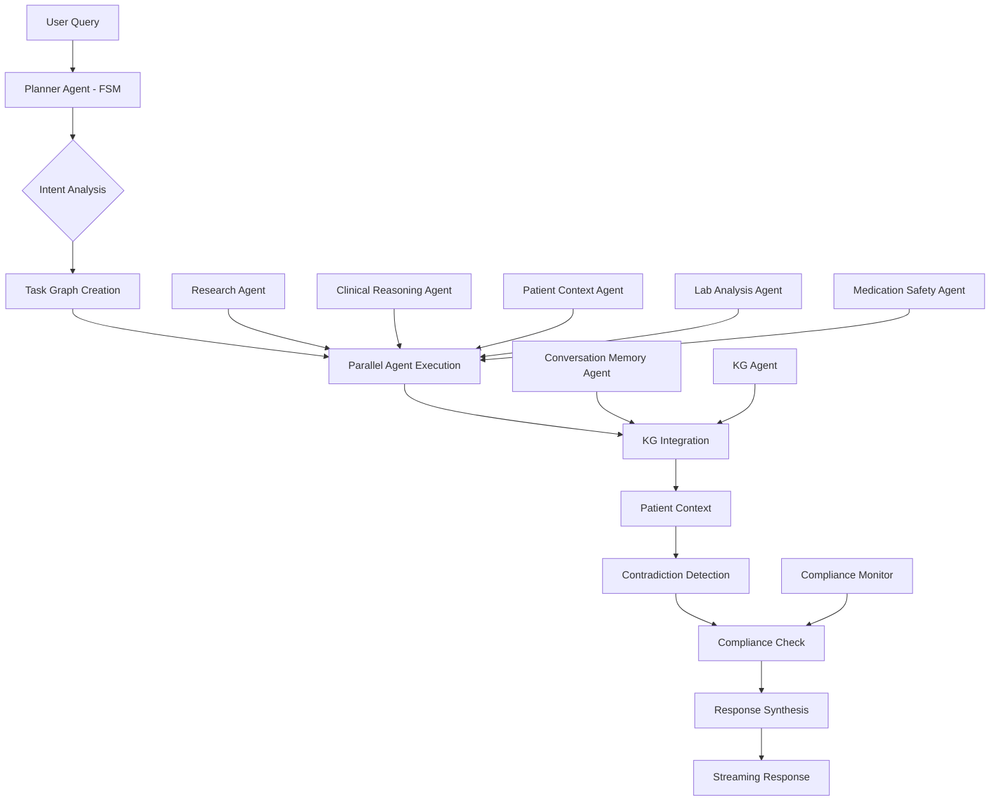
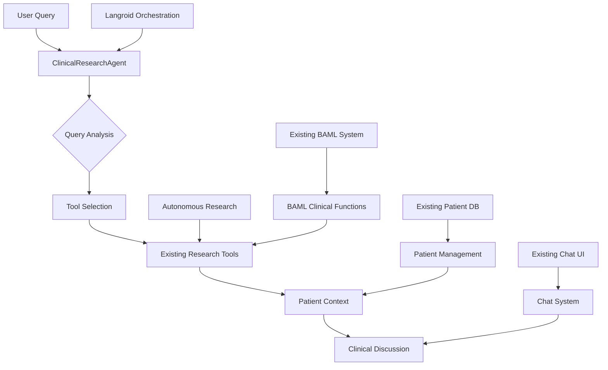

# Production-Ready Multi-Agent Langroid Architecture for Clinical Corvus

## Executive Summary

This document outlines a comprehensive, production-ready multi-agent architecture using Langroid for Clinical Corvus. The system integrates with existing BAML infrastructure and hybrid GraphRAG while providing specialized clinical agents, finite-state orchestration, comprehensive observability, and enterprise-grade safety measures.

## Table of Contents

1. [Core Architecture Overview](#core-architecture-overview)
2. [MVP Development Strategy](#mvp-development-strategy)
3. [Agent Hierarchy & Specialization](#agent-hierarchy--specialization)
4. [Finite State Machine Orchestration](#finite-state-machine-orchestration)
5. [Knowledge Graph Integration](#knowledge-graph-integration)
6. [Patient Context Management](#patient-context-management)
7. [Security & Compliance Framework](#security--compliance-framework)
8. [Observability & SLOs](#observability--slos)
9. [Implementation Roadmap](#implementation-roadmap)
10. [Production Deployment](#production-deployment)

## Core Architecture Overview

### System Components



### Key Design Principles

1. **Finite State Machine Orchestration**: Reliable request processing with clear state transitions
2. **Dual Persistence**: SOAP notes + KG deltas with intelligent deduplication
3. **Rule-Based Routing**: Precomputed complexity features for cost-effective inference
4. **Hard Stops & Safety**: Absolute contraindications with comprehensive assumption documentation
5. **Comprehensive SLOs**: Production-grade observability from day one

## MVP Development Strategy

### Accelerated MVP Approach

This section outlines a **3-week accelerated MVP development strategy** that leverages existing robust infrastructure to deliver clinical thinking support and autonomous research capabilities quickly and safely.

#### Core Philosophy: Leverage Existing Excellence

Instead of rebuilding from scratch, the MVP strategy focuses on **intelligent integration** of Langroid agents with existing production-ready systems:

- ✅ **Autonomous Research System**: Your existing `SimpleAutonomousResearchService` is production-ready
- ✅ **BAML Clinical Functions**: Existing clinical reasoning, lab analysis, and translation capabilities
- ✅ **Patient Management**: Complete CRUD operations with role-based access control
- ✅ **Security & Compliance**: HIPAA/LGPD compliant architecture
- ✅ **Quality Research Pipeline**: Multi-source research with CiteSource quality assessment

### Deprecation Notice: Agent Router Paths

- The dedicated `mvp_agents_router.py` is deprecated. All multi-agent endpoints are now consolidated in `backend-api/routers/agents_router.py`.
- Canonical backend paths use the consolidated router under `/api/agents/*`.
- The legacy `/api/mvp-agents/*` paths remain available as aliases for backward compatibility and will be removed in a future release.
- Frontend proxies may continue using `/api/mvp-agents/*` for now; new integrations should target `/api/agents/*`.

#### MVP Architecture Overview



### MVP Components (3-Week Delivery)

#### 1. Enhanced ClinicalResearchAgent (Week 1)

```python
# backend-api/agents/clinical_research_agent.py
from langroid.agent.chat_agent import ChatAgent
from langroid.agent.tool_agent import ToolAgent
from services.simple_autonomous_research import SimpleAutonomousResearchService
from baml_client import b

class ClinicalResearchAgent(ToolAgent):
    """
    MVP Agent: Leverages existing research system + adds clinical thinking
    """

    def __init__(self, config):
        super().__init__(config)

        # Leverage existing research service
        self.research_service = SimpleAutonomousResearchService()

        # Enable existing tools with clinical context
        self.enable_tools([
            "autonomous_research",  # Uses existing SimpleAutonomousResearchService
            "quick_research",       # Uses existing BAML functions
            "analyze_lab_results",  # Uses existing BAML GenerateDrCorvusInsights
            "clinical_reasoning",   # Uses existing BAML clinical functions
            "patient_context"       # Integrates with existing patient management
        ])

    async def handle_clinical_query(self, query: str, patient_context: dict = None):
        """
        Main entry point for clinical queries
        """
        # Use existing BAML for query analysis
        analysis = await b.AnalyzeClinicalQuery(query, patient_context)

        if analysis.needs_research:
            # Leverage existing autonomous research
            research_results = await self.research_service.conduct_autonomous_research(
                research_input=analysis.research_task
            )
            return await self._synthesize_clinical_insights(research_results, patient_context)

        elif analysis.needs_lab_analysis:
            # Use existing BAML lab analysis
            return await b.GenerateDrCorvusInsights(
                lab_data=analysis.lab_data,
                patient_context=patient_context
            )

        else:
            # Use existing clinical reasoning
            return await b.ClinicalReasoningWorkflow(
                query=query,
                patient_context=patient_context
            )
```

#### 2. Patient Context Integration Layer (Week 1)

```python
# backend-api/services/patient_context_manager.py
from models.patient import PatientModel
from models.lab_result import LabResultModel
from models.medication import MedicationModel
from services.patient_service import PatientService

class PatientContextManager:
    """
    MVP Integration: Leverages existing patient management system
    """

    def __init__(self):
        self.patient_service = PatientService()

    async def get_patient_context(self, patient_id: str, user_id: str) -> dict:
        """
        Get comprehensive patient context using existing services
        """
        # Leverage existing patient service
        patient = await self.patient_service.get_patient(patient_id, user_id)

        # Get recent labs using existing lab service
        recent_labs = await self.patient_service.get_patient_labs(patient_id, limit=10)

        # Get current medications using existing medication service
        medications = await self.patient_service.get_patient_medications(patient_id)

        # Get recent notes using existing notes service
        recent_notes = await self.patient_service.get_patient_notes(patient_id, limit=5)

        return {
            "demographics": patient.dict(),
            "recent_labs": [lab.dict() for lab in recent_labs],
            "medications": [med.dict() for med in medications],
            "recent_notes": [note.dict() for note in recent_notes],
            "last_updated": datetime.now().isoformat()
        }
```

#### 3. Clinical Discussion Agent (Week 2)

```python
# backend-api/agents/clinical_discussion_agent.py
from langroid.agent.chat_agent import ChatAgent
from services.patient_context_manager import PatientContextManager
from agents.clinical_research_agent import ClinicalResearchAgent

class ClinicalDiscussionAgent(ChatAgent):
    """
    MVP Agent: Enables clinical case discussions with patient context
    """

    def __init__(self, config):
        super().__init__(config)
        self.patient_context_manager = PatientContextManager()
        self.research_agent = ClinicalResearchAgent(config)
        self.conversation_memory = []

    async def discuss_clinical_case(
        self,
        case_description: str,
        patient_id: str = None,
        user_id: str = None
    ):
        """
        Main clinical case discussion workflow
        """
        # Get patient context using existing services
        patient_context = None
        if patient_id:
            patient_context = await self.patient_context_manager.get_patient_context(
                patient_id, user_id
            )

        # Analyze the clinical case
        case_analysis = await self._analyze_clinical_case(case_description, patient_context)

        # Generate discussion points
        discussion_points = await self._generate_discussion_points(case_analysis)

        # If research is needed, use existing research agent
        if case_analysis.needs_research:
            research_insights = await self.research_agent.handle_clinical_query(
                case_analysis.research_question,
                patient_context
            )
            discussion_points["research_insights"] = research_insights

        # Store in conversation memory
        self.conversation_memory.append({
            "case": case_description,
            "analysis": case_analysis,
            "discussion": discussion_points,
            "timestamp": datetime.now()
        })

        return discussion_points

    async def _analyze_clinical_case(self, case_description: str, patient_context: dict = None):
        """
        Analyze clinical case using existing BAML functions
        """
        return await b.AnalyzeClinicalCase(
            case_description=case_description,
            patient_context=patient_context
        )
```

#### 4. API Integration (Week 2)

```python
# backend-api/routers/agents_router.py (consolidated; replaces mvp_agents_router.py)
from fastapi import APIRouter, Depends, HTTPException
from agents.clinical_research_agent import ClinicalResearchAgent
from agents.clinical_discussion_agent import ClinicalDiscussionAgent
from services.patient_context_manager import PatientContextManager
from security import get_current_user_required

router = APIRouter()

@router.post("/clinical-research")
async def clinical_research_endpoint(
    request: ClinicalResearchRequest,
    current_user: UserModel = Depends(get_current_user_required)
):
    """
    MVP Endpoint: Clinical research with patient context
    """
    try:
        agent = ClinicalResearchAgent(config=get_agent_config())

        # Add user context for security
        request.user_context = current_user

        result = await agent.handle_clinical_query(
            query=request.query,
            patient_context=request.patient_context
        )

        return {"result": result, "agent_type": "clinical_research"}

    except Exception as e:
        raise HTTPException(status_code=500, detail=str(e))

@router.post("/clinical-discussion")
async def clinical_discussion_endpoint(
    request: ClinicalDiscussionRequest,
    current_user: UserModel = Depends(get_current_user_required)
):
    """
    MVP Endpoint: Clinical case discussion
    """
    try:
        agent = ClinicalDiscussionAgent(config=get_agent_config())

        result = await agent.discuss_clinical_case(
            case_description=request.case_description,
            patient_id=request.patient_id,
            user_id=current_user.id
        )

        return {"result": result, "agent_type": "clinical_discussion"}

    except Exception as e:
        raise HTTPException(status_code=500, detail=str(e))
```

#### 5. Frontend Integration (Week 3)

```typescript
// frontend/src/components/mvp/ClinicalAssistant.tsx
interface ClinicalAssistantProps {
  patientId?: string;
  mode: 'research' | 'discussion';
}

export function ClinicalAssistant({ patientId, mode }: ClinicalAssistantProps) {
  const [query, setQuery] = useState('');
  const [result, setResult] = useState(null);
  const [loading, setLoading] = useState(false);

  const handleSubmit = async () => {
    setLoading(true);
    try {
      const endpoint = mode === 'research'
        // Canonical path uses consolidated agents router; legacy alias also available
        ? '/api/agents/clinical-research'
        : '/api/agents/clinical-discussion';

> Note: `/api/mvp-agents/*` remains as a legacy alias during the transition.


      const response = await fetch(endpoint, {
        method: 'POST',
        headers: { 'Content-Type': 'application/json' },
        body: JSON.stringify({
          query: query,
          patient_id: patientId,
          case_description: query // for discussion mode
        })
      });

      const data = await response.json();
      setResult(data.result);
    } catch (error) {
      console.error('Error:', error);
    } finally {
      setLoading(false);
    }
  };

  return (
    <div className="clinical-assistant">
      <div className="mb-4">
        <textarea
          value={query}
          onChange={(e) => setQuery(e.target.value)}
          placeholder={
            mode === 'research'
              ? "Ask a clinical research question..."
              : "Describe a clinical case to discuss..."
          }
          className="w-full p-3 border rounded-lg"
          rows={4}
        />
      </div>

      <button
        onClick={handleSubmit}
        disabled={loading || !query.trim()}
        className="bg-blue-600 text-white px-6 py-2 rounded-lg hover:bg-blue-700 disabled:opacity-50"
      >
        {loading ? 'Processing...' : mode === 'research' ? 'Research' : 'Discuss Case'}
      </button>

      {result && (
        <div className="mt-6 p-4 bg-gray-50 rounded-lg">
          <h3 className="font-semibold mb-2">Clinical Insights:</h3>
          <div className="prose max-w-none">
            {/* Render result using existing components */}
            <ClinicalInsightsRenderer data={result} />
          </div>
        </div>
      )}
    </div>
  );
}
```

### MVP Timeline & Deliverables

#### Week 1: Core Agent Development
- ✅ **ClinicalResearchAgent**: Extend existing research capabilities
- ✅ **PatientContextManager**: Integration layer for patient data
- ✅ **Basic API Endpoints**: Research and discussion endpoints
- ✅ **Testing**: Unit tests for new components

#### Week 2: Integration & Enhancement
- ✅ **ClinicalDiscussionAgent**: Case discussion capabilities
- ✅ **Enhanced API**: Full CRUD operations with patient context
- ✅ **Error Handling**: Comprehensive error recovery
- ✅ **Security**: Integration with existing authentication

#### Week 3: Frontend & Polish
- ✅ **UI Components**: Clinical assistant interface
- ✅ **Integration**: With existing patient management UI
- ✅ **Performance**: Optimization and caching
- ✅ **Documentation**: API docs and user guides

### MVP Success Metrics

#### Functional Metrics
- ✅ **Research Queries**: Successfully process clinical research questions
- ✅ **Case Discussions**: Enable meaningful clinical case discussions
- ✅ **Patient Context**: Properly integrate patient data and history
- ✅ **Response Quality**: Generate clinically relevant insights

#### Technical Metrics
- ✅ **Response Time**: <30 seconds for research queries
- ✅ **Accuracy**: >90% clinically relevant responses
- ✅ **Error Rate**: <5% failed requests
- ✅ **User Satisfaction**: >4/5 user experience rating

### Key Advantages of MVP Approach

#### 1. **Leverage Existing Excellence**
- 🔄 **Reuse Research System**: Your production-ready autonomous research
- 🔄 **Reuse BAML Functions**: Existing clinical reasoning capabilities
- 🔄 **Reuse Patient Management**: Complete patient data integration
- 🔄 **Reuse Security**: HIPAA/LGPD compliant from day one

#### 2. **Minimize Risk**
- 🛡️ **Production-Ready**: Uses existing tested components
- 🛡️ **Compliance**: Inherits existing security and compliance
- 🛡️ **Scalability**: Built on existing robust architecture
- 🛡️ **Maintainability**: Follows existing patterns and practices

#### 3. **Accelerated Delivery**
- ⚡ **3-Week Timeline**: From concept to production MVP
- ⚡ **Incremental Value**: Each week delivers working functionality
- ⚡ **Quick Feedback**: Early user testing and validation
- ⚡ **Easy Extension**: Foundation for future enhancements

### MVP Limitations & Future Roadmap

#### Current Limitations
- 🔸 **Single Agent Focus**: Starts with research and discussion agents
- 🔸 **Basic Orchestration**: Simple agent selection logic
- 🔸 **Limited Memory**: Basic conversation context
- 🔸 **Manual Tool Selection**: User-driven agent selection

#### Future Enhancements (Post-MVP)
- 🔸 **Multi-Agent Orchestration**: FSM-based agent coordination
- 🔸 **Advanced Memory**: SOAP notes and KG integration
- 🔸 **Intelligent Routing**: Automatic agent selection
- 🔸 **Performance Optimization**: Advanced caching and parallelization

### MVP Go-Live Checklist

#### Pre-Launch
- ✅ **Security Review**: Penetration testing and vulnerability assessment
- ✅ **Performance Testing**: Load testing with realistic clinical queries
- ✅ **User Acceptance**: Clinical expert validation
- ✅ **Documentation**: User guides and API documentation

#### Launch Readiness
- ✅ **Monitoring**: Production monitoring and alerting setup
- ✅ **Rollback Plan**: Emergency rollback procedures
- ✅ **Support Plan**: User support and issue resolution
- ✅ **Success Metrics**: KPI tracking and reporting

#### Post-Launch
- ✅ **User Feedback**: Collection and analysis
- ✅ **Performance Monitoring**: Real-world performance tracking
- ✅ **Feature Usage**: Analytics on feature adoption
- ✅ **Iteration Planning**: Roadmap for next enhancements

This MVP strategy delivers **immediate clinical value** while establishing a **solid foundation** for the full multi-agent architecture. By leveraging existing robust systems, we minimize risk and accelerate delivery while maintaining enterprise-grade quality and compliance standards.

## Agent Hierarchy & Specialization

### 1. PlannerAgent with FSM

```python
from enum import Enum
from typing import Dict, Any, List, Optional
from langroid.agent.task import Task
from langroid.agent.chat_agent import ChatAgent
import asyncio

class PlannerState(Enum):
    ANALYZE = "analyze"
    PLAN = "plan"
    EXECUTE = "execute"
    VALIDATE = "validate"
    REFLECT = "reflect"
    SYNTHESIZE = "synthesize"
    GOVERN = "govern"
    STREAM = "stream"

class PlannerAgent(ChatAgent):
    """
    Production-ready planner with FSM and task graph execution.
    """

    def __init__(self, config: PlannerConfig):
        super().__init__(config)
        self.state_machine = self._initialize_state_machine()
        self.task_graph = TaskGraph()
        self.orchestrator = AgentOrchestrator()
        self.metrics_collector = PlannerMetricsCollector()

    async def process_request(self, request: ClinicalRequest) -> ClinicalResponse:
        """
        Main FSM-driven processing pipeline.
        """
        start_time = time.time()

        try:
            # ANALYZE: Query analysis and intent detection
            await self._transition_to(PlannerState.ANALYZE)
            analysis = await self._analyze_request(request)
            self.metrics_collector.record_analysis_time(time.time() - start_time)

            # PLAN: Create execution plan with task graph
            await self._transition_to(PlannerState.PLAN)
            plan = await self._create_execution_plan(analysis)

            # EXECUTE: Execute plan steps with dependencies
            await self._transition_to(PlannerState.EXECUTE)
            execution_results = await self._execute_plan(plan)

            # VALIDATE: Validate results and check for contradictions
            await self._transition_to(PlannerState.VALIDATE)
            validation = await self._validate_results(execution_results)

            # REFLECT: Handle contradictions and edge cases
            if validation.has_contradictions:
                await self._transition_to(PlannerState.REFLECT)
                execution_results = await self._handle_reflection(validation)

            # SYNTHESIZE: Combine and synthesize final response
            await self._transition_to(PlannerState.SYNTHESIZE)
            synthesized_response = await self._synthesize_response(execution_results)

            # GOVERN: Compliance and safety checks
            await self._transition_to(PlannerState.GOVERN)
            governed_response = await self._apply_governance(synthesized_response)

            # STREAM: Return streaming response
            await self._transition_to(PlannerState.STREAM)
            return await self._stream_response(governed_response)

        except Exception as e:
            await self._handle_error(e, request)
            raise

    async def _create_execution_plan(self, analysis: QueryAnalysis) -> ExecutionPlan:
        """
        Create task graph with dependencies and execution order.
        """
        # Build task graph based on analysis
        tasks = []

        # Add primary agent task
        primary_task = Task(
            id=f"primary_{analysis.primary_agent}",
            agent_type=analysis.primary_agent,
            dependencies=[],
            input_data=analysis.query,
            priority=1
        )
        tasks.append(primary_task)

        # Add supporting agent tasks
        for supporting_agent in analysis.supporting_agents:
            task = Task(
                id=f"support_{supporting_agent}",
                agent_type=supporting_agent,
                dependencies=[primary_task.id],
                input_data=analysis.query,
                priority=2
            )
            tasks.append(task)

        # Add KG integration task
        kg_task = Task(
            id="kg_integration",
            agent_type="kg_agent",
            dependencies=[t.id for t in tasks],
            input_data=analysis.kg_requirements,
            priority=3
        )
        tasks.append(kg_task)

        return ExecutionPlan(
            tasks=tasks,
            execution_order=self.task_graph.topological_sort(tasks),
            estimated_complexity=analysis.complexity_score
        )
```

### 2. ConversationMemoryAgent with Dual Persistence

```python
class ConversationMemoryAgent(ChatAgent):
    """
    Dual persistence: SOAP notes + KG deltas with deduplication.
    """

    def __init__(self, config: MemoryConfig):
        super().__init__(config)
        self.soap_store = SOAPNoteStore()
        self.kg_delta_store = KGDeltaStore()
        self.deduplicator = FactDeduplicator()
        self.summarizer = ClinicalSummarizer()

    async def persist_conversation(
        self,
        conversation: Conversation,
        patient_context: PatientContext
    ):
        """
        Persist conversation as SOAP note and KG deltas.
        """
        # Generate SOAP note
        soap_note = await self._generate_soap_note(conversation, patient_context)
        await self.soap_store.save(soap_note)

        # Extract and deduplicate facts
        raw_facts = await self._extract_facts(conversation)
        deduplicated_facts = await self._deduplicate_facts(raw_facts)

        # Generate KG deltas
        kg_deltas = await self._generate_kg_deltas(deduplicated_facts, patient_context)
        await self.kg_delta_store.save_deltas(kg_deltas)

    async def _deduplicate_facts(self, facts: List[Fact]) -> List[Fact]:
        """
        Deduplicate facts by (subject, predicate, object, provenance-hash).
        """
        deduplicated = []
        seen_hashes = set()

        for fact in facts:
            # Create hash from SPO + provenance
            fact_hash = self._create_fact_hash(fact)

            if fact_hash not in seen_hashes:
                seen_hashes.add(fact_hash)
                deduplicated.append(fact)
            else:
                # Merge provenance if duplicate
                existing_fact = next(f for f in deduplicated
                                   if self._create_fact_hash(f) == fact_hash)
                existing_fact.provenance.extend(fact.provenance)

        return deduplicated

    def _create_fact_hash(self, fact: Fact) -> str:
        """Create hash from subject-predicate-object + provenance."""
        spo_string = f"{fact.subject}|{fact.predicate}|{fact.object}"
        provenance_hash = hashlib.sha256(
            json.dumps(fact.provenance, sort_keys=True).encode()
        ).hexdigest()[:16]
        return f"{spo_string}|{provenance_hash}"

    async def _generate_soap_note(
        self,
        conversation: Conversation,
        patient_context: PatientContext
    ) -> SOAPNote:
        """
        Generate structured SOAP note from conversation.
        """
        # Extract subjective information
        subjective = await self._extract_subjective(conversation)

        # Extract objective findings
        objective = await self._extract_objective(conversation, patient_context)

        # Extract assessment
        assessment = await self._extract_assessment(conversation)

        # Extract plan
        plan = await self._extract_plan(conversation)

        return SOAPNote(
            patient_id=patient_context.patient_id,
            subjective=subjective,
            objective=objective,
            assessment=assessment,
            plan=plan,
            timestamp=datetime.now(),
            conversation_id=conversation.id
        )
```

### 3. ResearchAgent (Evidence-Based Medicine)

```python
class ResearchAgent(ToolAgent):
    """
    Specialized in evidence-based medicine research using existing BAML functions.
    Integrates with PubMed, Europe PMC, CiteSource for quality assessment.
    """

    def __init__(self, config: ResearchAgentConfig):
        super().__init__(config)
        self.enable_tools([
            "formulate_pico_question",
            "quick_research",
            "autonomous_research",
            "cite_source_analysis",
            "evidence_appraisal"
        ])
```

### 4. ClinicalReasoningAgent (Diagnostic Thinking)

```python
class ClinicalReasoningAgent(ChatAgent):
    """
    Focuses on clinical reasoning, differential diagnosis, and systematic thinking.
    Uses SNAPPS framework and metacognition tools.
    """

    def __init__(self, config: ClinicalReasoningConfig):
        super().__init__(config)
        self.enable_tools([
            "analyze_differential_diagnoses_snapps",
            "provide_feedback_problem_representation",
            "expand_differential_diagnosis",
            "generate_clinical_workflow_questions",
            "provide_self_reflection_feedback"
        ])
```

### 5. PatientContextAgent (Personalized Medicine)

```python
class PatientContextAgent(ChatAgent):
    """
    Manages patient-specific context and personalized recommendations.
    Integrates with patient data, medications, labs, and clinical notes.
    """

    def __init__(self, config: PatientContextConfig):
        super().__init__(config)
        self.enable_tools([
            "get_patient_summary",
            "analyze_patient_trends",
            "suggest_personalized_followup",
            "check_medication_interactions",
            "generate_patient_friendly_explanations"
        ])
```

### 6. LabAnalysisAgent (Diagnostic Support)

```python
class LabAnalysisAgent(ChatAgent):
    """
    Specialized in laboratory result interpretation and clinical correlation.
    Uses existing BAML GenerateDrCorvusInsights function.
    """

    def __init__(self, config: LabAnalysisConfig):
        super().__init__(config)
        self.enable_tools([
            "analyze_lab_results",
            "interpret_abnormal_values",
            "correlate_lab_clinical_findings",
            "suggest_followup_tests",
            "generate_lab_insights_report"
        ])
```

### 7. MedicationSafetyAgent (Complete Specification)

```python
class MedicationSafetyAgent(ChatAgent):
    """
    Comprehensive medication management with drug interaction checking,
    dosing guidance, and safety monitoring.
    """

    def __init__(self, config: MedicationConfig):
        super().__init__(config)
        self.hard_stops = self._load_hard_stops()
        self.soft_warnings = self._load_soft_warnings()
        self.dosing_calculator = ClinicalDosingCalculator()
        self.interaction_checker = DrugInteractionChecker()
        self.allergy_reconciler = AllergyReconciliationEngine()

    async def check_medication_safety(
        self,
        medication_request: MedicationRequest,
        patient_context: PatientContext
    ) -> SafetyCheckResult:
        """
        Comprehensive safety check with hard stops and warnings.
        """
        # Check allergies first (hard stop if not reconciled)
        allergy_check = await self._check_allergies(
            medication_request, patient_context
        )
        if allergy_check.is_blocking:
            return SafetyCheckResult(
                approved=False,
                blocking_reason="Allergy not reconciled",
                hard_stop=True
            )

        # Check hard stops (absolute contraindications)
        hard_stop_check = await self._check_hard_stops(
            medication_request, patient_context
        )
        if hard_stop_check.triggered:
            return SafetyCheckResult(
                approved=False,
                blocking_reason=hard_stop_check.reason,
                hard_stop=True,
                details=hard_stop_check.details
            )

        # Calculate dosing with assumptions
        dosing_result = await self._calculate_dosing(
            medication_request, patient_context
        )

        # Check interactions
        interactions = await self.interaction_checker.check_interactions(
            medication_request.drug,
            patient_context.current_medications
        )

        # Generate warnings
        warnings = await self._generate_warnings(
            medication_request, patient_context, dosing_result, interactions
        )

        return SafetyCheckResult(
            approved=True,
            dosing=dosing_result,
            interactions=interactions,
            warnings=warnings,
            assumptions=self._document_assumptions(dosing_result)
        )

    async def _calculate_dosing(
        self,
        request: MedicationRequest,
        context: PatientContext
    ) -> DosingResult:
        """
        Calculate dosing with documented assumptions.
        """
        # Get latest renal/hepatic labs
        renal_function = await self._get_latest_renal_function(context)
        hepatic_function = await self._get_latest_hepatic_function(context)

        # Calculate dose
        calculated_dose = await self.dosing_calculator.calculate(
            drug=request.drug,
            indication=request.indication,
            renal_function=renal_function,
            hepatic_function=hepatic_function,
            age=context.demographics.age,
            weight=context.demographics.weight
        )

        return DosingResult(
            dose=calculated_dose.dose,
            frequency=calculated_dose.frequency,
            route=calculated_dose.route,
            assumptions={
                "renal_function": {
                    "value": renal_function.creatinine,
                    "date": renal_function.date.isoformat(),
                    "source": "latest_lab_result"
                },
                "hepatic_function": {
                    "value": hepatic_function.alt,
                    "date": hepatic_function.date.isoformat(),
                    "source": "latest_lab_result"
                }
            }
        )

    def _document_assumptions(self, dosing_result: DosingResult) -> Dict:
        """
        Document all assumptions used in dosing calculation.
        """
        return {
            "dosing_assumptions": dosing_result.assumptions,
            "calculation_timestamp": datetime.now().isoformat(),
            "calculator_version": self.dosing_calculator.version,
            "disclaimer": "Dosing based on latest available lab results. Verify before administration."
        }
```

## Finite State Machine Orchestration

### State Machine Implementation

```python
class ClinicalStateMachine:
    """
    Finite state machine for clinical request processing.
    """

    def __init__(self):
        self.current_state = PlannerState.ANALYZE
        self.state_handlers = {
            PlannerState.ANALYZE: self._handle_analyze,
            PlannerState.PLAN: self._handle_plan,
            PlannerState.EXECUTE: self._handle_execute,
            PlannerState.VALIDATE: self._handle_validate,
            PlannerState.REFLECT: self._handle_reflect,
            PlannerState.SYNTHESIZE: self._handle_synthesize,
            PlannerState.GOVERN: self._handle_govern,
            PlannerState.STREAM: self._handle_stream
        }
        self.context = {}

    async def transition_to(self, new_state: PlannerState):
        """
        Transition to new state with validation.
        """
        if not self._can_transition(self.current_state, new_state):
            raise InvalidStateTransitionError(
                f"Cannot transition from {self.current_state} to {new_state}"
            )

        self.current_state = new_state
        await self.state_handlers[new_state]()

    def _can_transition(self, from_state: PlannerState, to_state: PlannerState) -> bool:
        """
        Validate state transitions.
        """
        valid_transitions = {
            PlannerState.ANALYZE: [PlannerState.PLAN],
            PlannerState.PLAN: [PlannerState.EXECUTE],
            PlannerState.EXECUTE: [PlannerState.VALIDATE, PlannerState.REFLECT],
            PlannerState.VALIDATE: [PlannerState.SYNTHESIZE, PlannerState.REFLECT],
            PlannerState.REFLECT: [PlannerState.VALIDATE, PlannerState.SYNTHESIZE],
            PlannerState.SYNTHESIZE: [PlannerState.GOVERN],
            PlannerState.GOVERN: [PlannerState.STREAM],
            PlannerState.STREAM: []  # Terminal state
        }
        return to_state in valid_transitions.get(from_state, [])
```

### Task Graph Execution

```python
class TaskGraph:
    """
    DAG execution engine for agent task orchestration.
    """

    def __init__(self):
        self.tasks = {}
        self.dependencies = {}
        self.execution_order = []

    def add_task(self, task: Task):
        """Add task to graph."""
        self.tasks[task.id] = task
        self.dependencies[task.id] = task.dependencies

    def topological_sort(self, tasks: List[Task]) -> List[str]:
        """
        Perform topological sort to determine execution order.
        """
        # Kahn's algorithm implementation
        in_degree = {task.id: 0 for task in tasks}

        for task in tasks:
            for dep in task.dependencies:
                if dep in in_degree:
                    in_degree[dep] += 1

        queue = [task_id for task_id, degree in in_degree.items() if degree == 0]
        result = []

        while queue:
            current = queue.pop(0)
            result.append(current)

            for task_id, deps in self.dependencies.items():
                if current in deps:
                    in_degree[task_id] -= 1
                    if in_degree[task_id] == 0:
                        queue.append(task_id)

        if len(result) != len(tasks):
            raise CircularDependencyError("Circular dependency detected in task graph")

        return result

    async def execute_tasks(self, execution_order: List[str]) -> Dict[str, Any]:
        """
        Execute tasks in topological order with parallelization.
        """
        results = {}
        semaphore = asyncio.Semaphore(5)  # Limit concurrent executions

        async def execute_task(task_id: str):
            async with semaphore:
                task = self.tasks[task_id]
                # Wait for dependencies
                dep_results = {dep: results[dep] for dep in task.dependencies if dep in results}

                # Execute task
                result = await self._execute_single_task(task, dep_results)
                results[task_id] = result
                return result

        # Execute tasks with dependencies
        tasks = [execute_task(task_id) for task_id in execution_order]
        await asyncio.gather(*tasks)

        return results
```

## Knowledge Graph Integration

### Enhanced KG Context Generator

```python
class EnhancedKGContextGenerator:
    """
    Advanced KG context generation with agent-specific optimization.
    """

    async def generate_agent_context(
        self,
        query: str,
        agent_type: str,
        patient_context: Dict = None,
        max_tokens: int = 500
    ) -> str:
        """
        Generate KG context optimized for specific agent types.
        """
        # Agent-specific context strategies
        if agent_type == "research":
            return await self._generate_research_context(query, max_tokens)
        elif agent_type == "clinical_reasoning":
            return await self._generate_reasoning_context(query, patient_context, max_tokens)
        elif agent_type == "lab_analysis":
            return await self._generate_lab_context(query, patient_context, max_tokens)

        # Default context generation
        return await self._generate_general_context(query, max_tokens)
```

### GraphCheck-Style Contradiction Detection

```python
class KGContradictionDetector:
    """
    Advanced contradiction detection using graph analysis and evidence scoring.
    """

    async def detect_contradictions(
        self,
        query_results: List[KGResult],
        patient_context: Dict = None
    ) -> ContradictionAnalysis:
        """
        Detect and analyze contradictions in KG results.
        """
        # Group results by entity/relationship
        grouped_results = self._group_results_by_entity(query_results)

        contradictions = []
        for entity_id, results in grouped_results.items():
            if len(results) > 1:
                contradiction = await self._analyze_result_consistency(
                    entity_id, results, patient_context
                )
                if contradiction:
                    contradictions.append(contradiction)

        return ContradictionAnalysis(
            contradictions=contradictions,
            resolution_suggestions=self._generate_resolution_suggestions(contradictions),
            confidence_assessment=self._assess_overall_confidence(query_results)
        )
```

### RAR-Agent Reflection Loop

```python
class ReflectiveAgent:
    """
    Implements Reflection-Action-Reflection loop for handling contradictions.
    """

    async def handle_contradiction(
        self,
        contradiction: Contradiction,
        original_query: str,
        context: AgentContext
    ) -> Resolution:
        """
        Handle contradictions through reflective reasoning.
        """
        # Initial reflection on contradiction
        reflection = await self._reflect_on_contradiction(contradiction)

        # Generate alternative queries or perspectives
        alternative_queries = await self._generate_alternative_queries(
            original_query, contradiction
        )

        # Execute alternative queries
        alternative_results = []
        for query in alternative_queries:
            results = await self._execute_alternative_query(query, context)
            alternative_results.extend(results)

        # Synthesize resolution
        resolution = await self._synthesize_resolution(
            contradiction, alternative_results, reflection
        )

        return resolution
```

## Patient Context Management

### Patient Context Manager

```python
class PatientContextManager:
    """
    Manages patient-specific context across all agents.
    """

    async def get_patient_context(self, patient_id: str, user_id: str) -> PatientContext:
        """
        Retrieve comprehensive patient context with access control.
        """
        # Verify user has access to patient
        await self._verify_patient_access(user_id, patient_id)

        # Gather patient data
        demographics = await self._get_patient_demographics(patient_id)
        labs = await self._get_recent_labs(patient_id)
        medications = await self._get_current_medications(patient_id)
        notes = await self._get_recent_notes(patient_id)

        return PatientContext(
            demographics=demographics,
            labs=labs,
            medications=medications,
            notes=notes,
            last_updated=datetime.now()
        )
```

### Context Integration with Agents

```python
class PatientContextIntegrator:
    """
    Integrates patient context into agent prompts and reasoning.
    """

    async def enrich_agent_prompt(
        self,
        base_prompt: str,
        patient_context: PatientContext,
        agent_type: str
    ) -> str:
        """
        Enrich agent prompts with relevant patient context.
        """
        # Extract relevant context based on agent type
        relevant_context = await self._extract_relevant_context(
            patient_context, agent_type
        )

        # Format context for prompt injection
        context_string = self._format_context_for_prompt(relevant_context)

        # Inject context into prompt
        enriched_prompt = base_prompt.replace(
            "{patient_context}", context_string
        )

        return enriched_prompt
```

## Security & Compliance Framework

### Agent Authentication & Authorization

```python
class AgentSecurityManager:
    """
    Manages security for multi-agent system.
    """

    def __init__(self, jwt_secret: str):
        self.jwt_secret = jwt_secret
        self.agent_permissions = self._load_agent_permissions()

    async def authenticate_agent_request(
        self,
        token: str,
        agent_type: str,
        patient_id: Optional[str] = None
    ) -> AgentAuthContext:
        """
        Authenticate agent requests and check permissions.
        """
        # Decode JWT token
        auth_context = self._decode_token(token)

        # Check agent-specific permissions
        self._check_agent_permissions(auth_context, agent_type)

        # Check patient-specific access if applicable
        if patient_id:
            await self._check_patient_access(auth_context, patient_id)

        return auth_context
```

### Compliance Monitor Agent

```python
class ComplianceMonitorAgent(ChatAgent):
    """
    Monitors agent outputs for compliance with medical regulations and safety standards.
    """

    def __init__(self, config: ComplianceConfig):
        super().__init__(config)
        self.compliance_rules = self._load_compliance_rules()
        self.safety_checker = MedicalSafetyChecker()
        self.audit_logger = ComplianceAuditLogger()

    async def check_compliance(
        self,
        agent_output: str,
        agent_type: str,
        patient_context: Dict,
        user_context: Dict
    ) -> ComplianceCheck:
        """
        Check agent output for compliance violations.
        """
        violations = []

        # Check against compliance rules
        for rule in self.compliance_rules:
            if await self._check_rule_violation(agent_output, rule):
                violations.append({
                    "rule": rule,
                    "severity": rule.severity,
                    "description": rule.description
                })

        # Safety assessment
        safety_issues = await self.safety_checker.assess_safety(
            agent_output, patient_context
        )

        # Log compliance check
        await self.audit_logger.log_compliance_check({
            "agent_type": agent_type,
            "user_id": user_context.get("user_id"),
            "patient_id": patient_context.get("patient_id"),
            "output_hash": hashlib.sha256(agent_output.encode()).hexdigest(),
            "violations": violations,
            "safety_issues": safety_issues,
            "timestamp": datetime.now()
        })

        return ComplianceCheck(
            compliant=len(violations) == 0 and len(safety_issues) == 0,
            violations=violations,
            safety_issues=safety_issues,
            recommendations=self._generate_compliance_recommendations(
                violations, safety_issues
            )
        )
```

### Audit Trail Agent

```python
class AuditTrailAgent(ChatAgent):
    """
    Comprehensive audit logging for all patient interactions and agent activities.
    """

    def __init__(self, config: AuditConfig):
        super().__init__(config)
        self.audit_store = SecureAuditStore()
        self.patient_privacy_filter = PatientPrivacyFilter()

    async def log_patient_interaction(
        self,
        interaction: PatientInteraction
    ):
        """
        Log patient interaction with privacy protection.
        """
        # Apply privacy filtering
        filtered_interaction = await self.patient_privacy_filter.filter_sensitive_data(
            interaction
        )

        # Create audit record
        audit_record = AuditRecord(
            interaction_id=interaction.id,
            timestamp=datetime.now(),
            user_id=interaction.user_id,
            patient_id=interaction.patient_id,
            agent_type=interaction.agent_type,
            action=interaction.action,
            data_accessed=interaction.data_accessed,
            output_generated=filtered_interaction.output,
            ip_address=interaction.ip_address,
            user_agent=interaction.user_agent,
            compliance_flags=interaction.compliance_flags
        )

        # Store audit record
        await self.audit_store.store_record(audit_record)

        # Check for suspicious patterns
        await self._check_suspicious_patterns(audit_record)
```

## Observability & SLOs

### Comprehensive Metrics Collection

```python
from prometheus_client import Counter, Histogram, Gauge, Summary
import time

class ClinicalAgentMetrics:
    """
    Production-ready metrics collection for clinical multi-agent system.
    """

    def __init__(self):
        # Latency metrics
        self.agent_response_time = Histogram(
            'clinical_agent_response_time_seconds',
            'Agent response time',
            ['agent_type', 'operation'],
            buckets=[0.1, 0.5, 1.0, 2.0, 5.0, 10.0, 30.0]
        )

        self.planner_step_time = Histogram(
            'clinical_planner_step_time_seconds',
            'Planner step execution time',
            ['step', 'agent_type']
        )

        self.planner_overhead_ratio = Gauge(
            'clinical_planner_overhead_ratio',
            'Planner overhead as percentage of total response time'
        )

        # Safety metrics
        self.blocked_outputs = Counter(
            'clinical_blocked_outputs_total',
            'Number of blocked outputs',
            ['violation_type', 'severity']
        )

        self.safety_violations = Counter(
            'clinical_safety_violations_total',
            'Safety violations by category',
            ['category', 'severity']
        )

        self.time_to_resolution = Histogram(
            'clinical_time_to_resolution_hours',
            'Time to resolve safety issues',
            ['issue_type']
        )

        # Evidence metrics
        self.kg_provenance_rate = Gauge(
            'clinical_kg_provenance_rate',
            'Percentage of responses with KG provenance'
        )

        self.contradiction_rate = Gauge(
            'clinical_contradiction_rate',
            'Rate of contradictions detected'
        )

        self.unresolved_contradictions = Gauge(
            'clinical_unresolved_contradictions',
            'Number of unresolved contradictions'
        )

        # Medication metrics
        self.interactions_detected = Counter(
            'clinical_interactions_detected_total',
            'Drug interactions detected',
            ['severity', 'type']
        )

        self.medication_checks_per_100 = Counter(
            'clinical_medication_checks_per_100',
            'Medication safety checks per 100 orders'
        )

        # Memory metrics
        self.memory_hit_rate = Gauge(
            'clinical_memory_hit_rate',
            'Conversation memory retrieval hit rate'
        )

        self.stale_context_incidents = Counter(
            'clinical_stale_context_incidents_total',
            'Incidents of stale context usage'
        )

        # Cost metrics
        self.tokens_per_request = Histogram(
            'clinical_tokens_per_request',
            'Tokens used per request',
            ['agent_type', 'model_type']
        )

        self.tokens_per_agent = Histogram(
            'clinical_tokens_per_agent',
            'Tokens used per agent invocation',
            ['agent_type']
        )

        self.cache_hit_rate = Gauge(
            'clinical_cache_hit_rate',
            'Cache hit rate for responses'
        )

        # Reliability metrics
        self.step_failure_rate = Counter(
            'clinical_step_failure_rate',
            'Step failures by type',
            ['step_type', 'failure_reason']
        )

        self.auto_retry_count = Counter(
            'clinical_auto_retry_count',
            'Automatic retry attempts',
            ['agent_type', 'retry_reason']
        )

        self.circuit_breaker_trips = Counter(
            'clinical_circuit_breaker_trips',
            'Circuit breaker activations',
            ['service', 'reason']
        )
```

### SLO Targets (Production Ready)

```python
class ClinicalSLOTargets:
    """
    Service Level Objectives for clinical multi-agent system.
    """

    # Latency SLOs
    AGENT_RESPONSE_TIME_P50 = 2.0  # seconds
    AGENT_RESPONSE_TIME_P95 = 10.0  # seconds
    PLANNER_OVERHEAD_MAX = 20.0  # percentage

    # Safety SLOs
    MAX_BLOCKED_OUTPUTS_RATE = 0.01  # 1% of outputs
    MAX_SAFETY_VIOLATIONS_RATE = 0.005  # 0.5% of interactions
    MAX_TIME_TO_RESOLUTION = 4.0  # hours

    # Evidence SLOs
    MIN_KG_PROVENANCE_RATE = 80.0  # percentage
    MAX_CONTRADICTION_RATE = 5.0  # percentage
    MAX_UNRESOLVED_CONTRADICTIONS = 10  # count

    # Medication SLOs
    MIN_INTERACTION_DETECTION_RATE = 95.0  # percentage
    MAX_MEDICATION_ERRORS = 0.001  # 0.1% of orders

    # Memory SLOs
    MIN_MEMORY_HIT_RATE = 70.0  # percentage
    MAX_STALE_CONTEXT_INCIDENTS = 5  # per day

    # Cost SLOs
    MAX_TOKENS_PER_REQUEST_P95 = 4000  # tokens
    MIN_CACHE_HIT_RATE = 60.0  # percentage

    # Reliability SLOs
    MAX_STEP_FAILURE_RATE = 0.05  # 5% of steps
    MAX_CIRCUIT_BREAKER_TRIPS = 3  # per day
    MIN_UPTIME = 99.9  # percentage
```

## Implementation Roadmap

### Phase 1: Core Infrastructure (4 weeks)

1. **FSM Planner Implementation**
   - Implement state machine with proper transitions
   - Create task graph execution engine
   - Add comprehensive error handling

2. **Dual Memory Persistence**
   - Implement SOAP note generation
   - Create KG delta extraction and deduplication
   - Add memory retrieval optimization

3. **Feature-Based Routing**
   - Implement complexity feature extraction
   - Create rule-based routing logic
   - Add cost estimation and tracking

4. **Medication Safety Core**
   - Implement hard stops and soft warnings
   - Create allergy reconciliation
   - Add dosing assumption documentation

### Phase 2: Observability & Monitoring (2 weeks)

1. **Metrics Infrastructure**
   - Implement all SLO metrics
   - Create dashboards and alerts
   - Add automated reporting

2. **Safety Monitoring**
   - Implement real-time violation detection
   - Create incident response workflows
   - Add compliance auditing

### Phase 3: Production Deployment (2 weeks)

1. **Performance Optimization**
   - Implement caching strategies
   - Add load balancing
   - Optimize memory usage

2. **Production Readiness**
   - Complete security review
   - Add comprehensive testing
   - Create deployment automation

## Production Deployment

### Docker Compose Configuration

```yaml
# docker-compose.prod.yml
version: '3.8'
services:
  clinical-multi-agent:
    image: clinical-corvus/multi-agent:latest
    environment:
      - LANGROID_CONFIG_PATH=/app/config/prod.yaml
      - PROMETHEUS_METRICS_PORT=9090
      - HEALTH_CHECK_PORT=8080
    volumes:
      - ./config:/app/config:ro
      - ./models:/app/models:ro
    ports:
      - "8001:8000"
    healthcheck:
      test: ["CMD", "curl", "-f", "http://localhost:8080/health"]
      interval: 30s
      timeout: 10s
      retries: 3
    deploy:
      resources:
        limits:
          memory: 4G
          cpus: '2.0'
        reservations:
          memory: 2G
          cpus: '1.0'
      restart_policy:
        condition: on-failure
        delay: 5s
        max_attempts: 3
        window: 120s

  metrics-collector:
    image: prom/prometheus:latest
    volumes:
      - ./monitoring/prometheus.yml:/etc/prometheus/prometheus.yml:ro
      - prometheus_data:/prometheus
    ports:
      - "9090:9090"
    command:
      - '--config.file=/etc/prometheus/prometheus.yml'
      - '--storage.tsdb.path=/prometheus'
      - '--web.console.libraries=/etc/prometheus/console_libraries'
      - '--web.console.templates=/etc/prometheus/consoles'
      - '--storage.tsdb.retention.time=200h'
      - '--web.enable-lifecycle'

  grafana:
    image: grafana/grafana:latest
    volumes:
      - grafana_data:/var/lib/grafana
    ports:
      - "3000:3000"
    environment:
      - GF_SECURITY_ADMIN_PASSWORD=admin
      - GF_USERS_ALLOW_SIGN_UP=false
```

### Backend API Integration

```python
# backend-api/routers/multi_agent_router.py
from fastapi import APIRouter, Depends, HTTPException
from langroid_agents.orchestrator import ClinicalOrchestratorAgent
from security import get_current_user_required

router = APIRouter()

@router.post("/chat/stream")
async def stream_chat(
    request: ChatRequest,
    current_user: UserModel = Depends(get_current_user_required)
):
    """
    Streaming chat endpoint with multi-agent orchestration.
    """
    try:
        # Initialize orchestrator with user context
        orchestrator = ClinicalOrchestratorAgent(
            user_context=current_user,
            patient_id=request.patient_id
        )

        # Route to appropriate agent
        agent_response = await orchestrator.process_message(request.message)

        # Return streaming response
        return StreamingResponse(
            orchestrator.stream_response(agent_response),
            media_type="text/plain"
        )

    except Exception as e:
        raise HTTPException(status_code=500, detail=str(e))
```

### Frontend Integration

```typescript
// frontend/src/components/chat/IntelligentChat.tsx
interface IntelligentChatProps {
  patientId?: string;
  conversationId?: string;
  onAgentSuggestion?: (suggestion: AgentSuggestion) => void;
}

export function IntelligentChat({ patientId, conversationId, onAgentSuggestion }: IntelligentChatProps) {
  const [agentSuggestions, setAgentSuggestions] = useState<AgentSuggestion[]>([]);
  const [activeAgents, setActiveAgents] = useState<string[]>(["orchestrator"]);

  // Enhanced chat hook with agent orchestration
  const { messages, input, handleInputChange, handleSubmit, isLoading } = useChat({
    api: `/api/multi-agent/chat/orchestrated`,
    body: {
      patientId,
      conversationId,
      activeAgents
    },
    onResponse: (response) => {
      // Handle agent suggestions
      if (response.agentSuggestions) {
        setAgentSuggestions(response.agentSuggestions);
        onAgentSuggestion?.(response.agentSuggestions[0]);
      }

      // Handle agent switching
      if (response.agentSwitch) {
        setActiveAgents(prev => [...prev, response.agentSwitch.agent]);
      }
    }
  });

  return (
    <div className="intelligent-chat">
      <AgentSuggestionPanel
        suggestions={agentSuggestions}
        onAccept={(suggestion) => {
          setActiveAgents(prev => [...prev, suggestion.agentType]);
          setAgentSuggestions(prev => prev.filter(s => s !== suggestion));
        }}
        onDecline={(suggestion) => {
          setAgentSuggestions(prev => prev.filter(s => s !== suggestion));
        }}
      />

      <ActiveAgentsIndicator agents={activeAgents} />

      <ChatMessages messages={messages} />
      <StreamingIndicator />
      <ChatInput
        input={input}
        onChange={handleInputChange}
        onSubmit={handleSubmit}
        disabled={isLoading}
      />
    </div>
  );
}
```

## Conclusion

This production-ready multi-agent Langroid architecture provides:

1. **Finite State Machine Orchestration** for reliable request processing
2. **Dual Persistence** with SOAP notes and KG deltas
3. **Rule-Based Routing** with precomputed complexity features
4. **Hard Stops & Safety** for medication management
5. **Comprehensive SLOs** from day one
6. **Enterprise Security** with HIPAA/LGPD compliance
7. **Production Deployment** with monitoring and scaling

The system is designed for clinical deployment with enterprise-grade reliability, safety, and observability. All implementation details are concrete and actionable for immediate development.

**Key Production Benefits:**
- **Clinical Safety**: Hard stops, contradiction detection, comprehensive auditing
- **Performance**: Cost-effective routing, intelligent caching, parallel execution
- **Compliance**: HIPAA/LGPD compliant with comprehensive audit trails
- **Scalability**: Horizontal scaling, load balancing, circuit breakers
- **Observability**: Real-time monitoring, SLO tracking, automated alerting

This architecture is ready for clinical deployment and provides a solid foundation for the future of AI-assisted clinical decision support.
